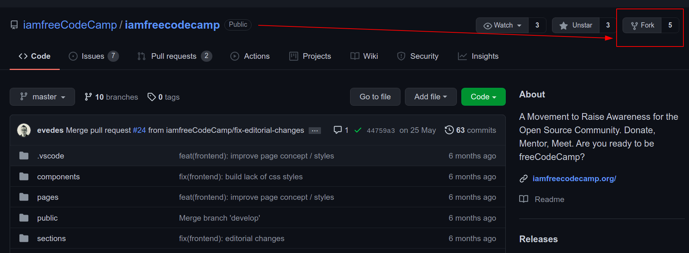
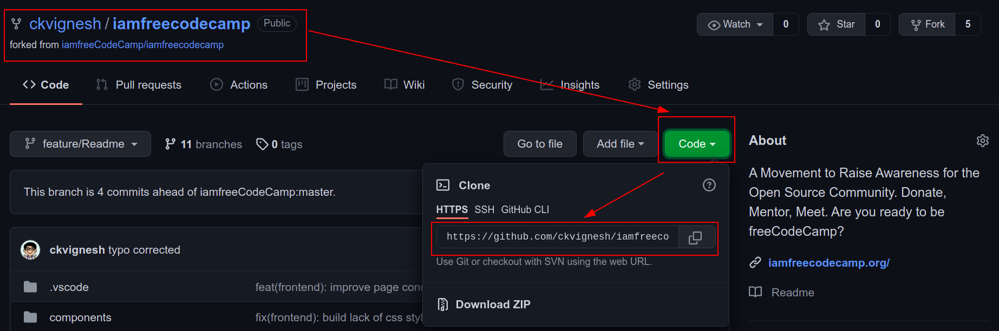
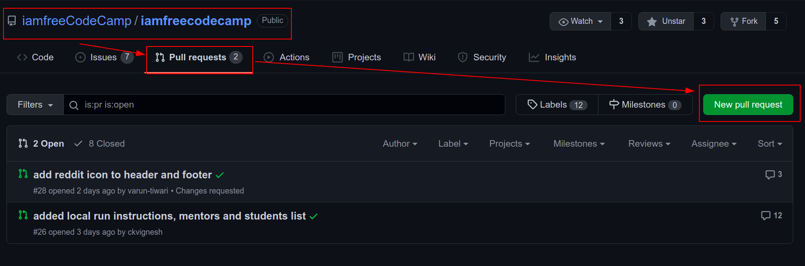
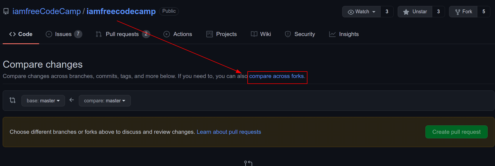
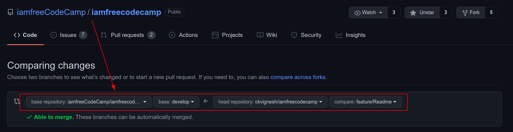
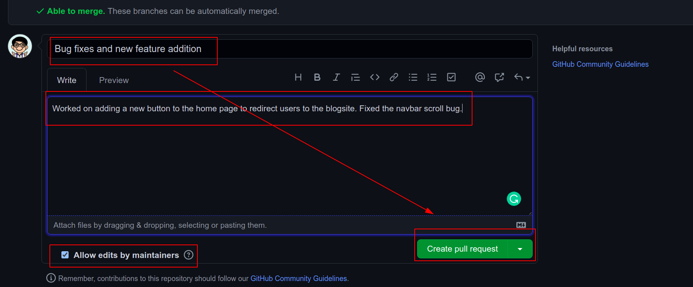

# Welcome to #iamfreeCodeCamp
***
## What is #iamfreeCodeCamp?

**#iamfreeCodeCamp** is a movement to raise awareness for the Open Source Community.
It's built around the freeCodeCamp community and presented as a challenge with the following goals:

1.  helping the non-profit to increase its sustainability by raising awareness on Alumni and Students to donate.

2.  provide mentorship to the students

3.  make Alumni get to know one another.

**🔥 #iamfreeCodeCamp** project is non-commercial, open source and with educational purposes.

***
## How to contribute?

If you have any suggestion please raise an issue in our repo.

If you want to participate as a developer:

1. create a fork from iamfreecodecamp repo.
   
   

2. clone the repo that was forked.
   
   

   Enter this in terminal: 
   `git clone https://github.com/iamfreeCodeCamp/iamfreecodecamp.git`

3. create a feature branch after cloning the repo. Open the repo from the code editor (Preferably VS Code). Create a `my-feature-branch` by entering this into the terminal. This is the branch where contributions can be made.
   
    `git checkout -b my-feature-branch`

4. run the Development Environment on the local machine by entering these commands into the terminal
      ```
      yarn install
      yarn dev
      ```
    the development environment will run on your local machine's [Port 3000](http://localhost:3000) by default.

5. contribute code and test it in the development environment.
    
6. after working on the feature branch it must be staged, committed and pushed to the remote i.e. your Repo that was cloned from `iamfreecodecamp`. Enter these commands into the terminal:
      ```
      git add .
      git commit -m "feat: my commit message"
      git push origin my-feature-branch
      ```

7. create a Pull Request to merge your contributions to the iamfreeCodeCamp Repo. Go to the iamfreeCodeCamp Repo and click `pull requests` 
   
   

   Click on `compare across forks`
   

8. submit the pull request to our `develop` branch. Do not create a Pull Request to our `master` branch.

   To achieve this, set the `Comparing Changes` as follows:
   

   ```
   base repository: iamfreeCodeCamp Repo
   base: develop
   head repository: your Forked Repo
   base: my-feature-branch
   ```
   You can see `Able to merge` in green which confirms that you can raise a PR.

9. scroll below and click on `Create Pull Request` after giving a detailed and well documented description about what your're doing (it maybe a feature / enhancement / bug fix). Keep the `Allow edits by maintainers` checked.
 
    

***
## Style guide

How to write on our site

A
alumni, alumnus - lower case.

N
Numbers one to nine spelled out. Use numerals for 10 and above.

***
## Website

The website is a Next.js app. It automatically deploys to Vercel when the master branch is updated.

***
## Mentors

1. Eduardo Vedes (eduardo.vedes@gmail.com)
2. Can Ural (can.ural@outlook.com)

***

<!-- ## Students

1.
2. 
*** -->
## Contributors


***
## Sponsors

Powered By

<a href="https://vercel.com?utm_source=iamfreecodecamp&utm_campaign=oss">

</a>

***
## FAQ

### 1. I am unable to run the development environment on PORT 3000 as there's something else running 

Refer to Step 4 of [How to contribute?](#how-to-contribute)

Run `PORT=3005 yarn dev` instead of `yarn dev`. You can use any other port number you wish to, instead of 3005. 